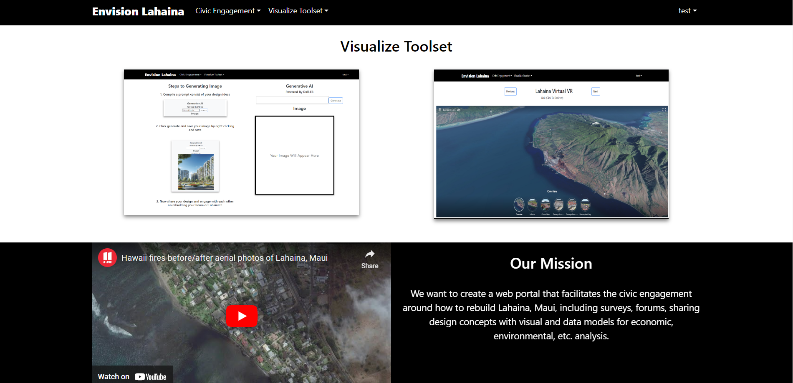

## Overview

We want to create a web portal that facilitates the civic engagement around how to rebuild Lahaina, Maui, including surveys, forums, sharing design concepts with visual and data models for economic, environmental, etc. analysis.

## Landing Page

The landing page for any new visitors or user who have not logged in yet. Vistior have options to sign up or sign in. 

## Home Page 

The Home Page is the first page that users will see when they Login, no other feature will be accessible unless user is signed in

## Civic Engagement

#### Forum

Forum consists of posting, commenting, searching base on titles, and viewing your own post by click on my posts. 

#### Survey

Survey page allows creating, voting and searching for an specific surveys base on contents. User are limited to voting once per survey to ensure fair and accurate results. 

#### Community

User have an option to add, edit or delete their profile. This is a page demonstrating profiles of all users who choose to add one. 

### Visualize Toolset

#### Generative-AI

Generative AI powered by Dall-E3, user give a prompt regarding their design or to envision Lahaina, then it will return a Image generated by AI in seconds. User also guaranteed 100% right to image generated. 

#### Gis Map

Embeded Gis Map with data visualization and 360 VR of scenes in Lahaina. 

#### External

Alternatively, clicking on the Login link, then on the Sign Up menu item displays this page:

#### Data (Coming Soon)

Data Dashboard including tools for deep analysis and visualization powered by AI and Python Libraries

#### Moderated Contents (Coming Soon)

Image and Contents Uploaded will be automatically moderated through AI and External Apis
